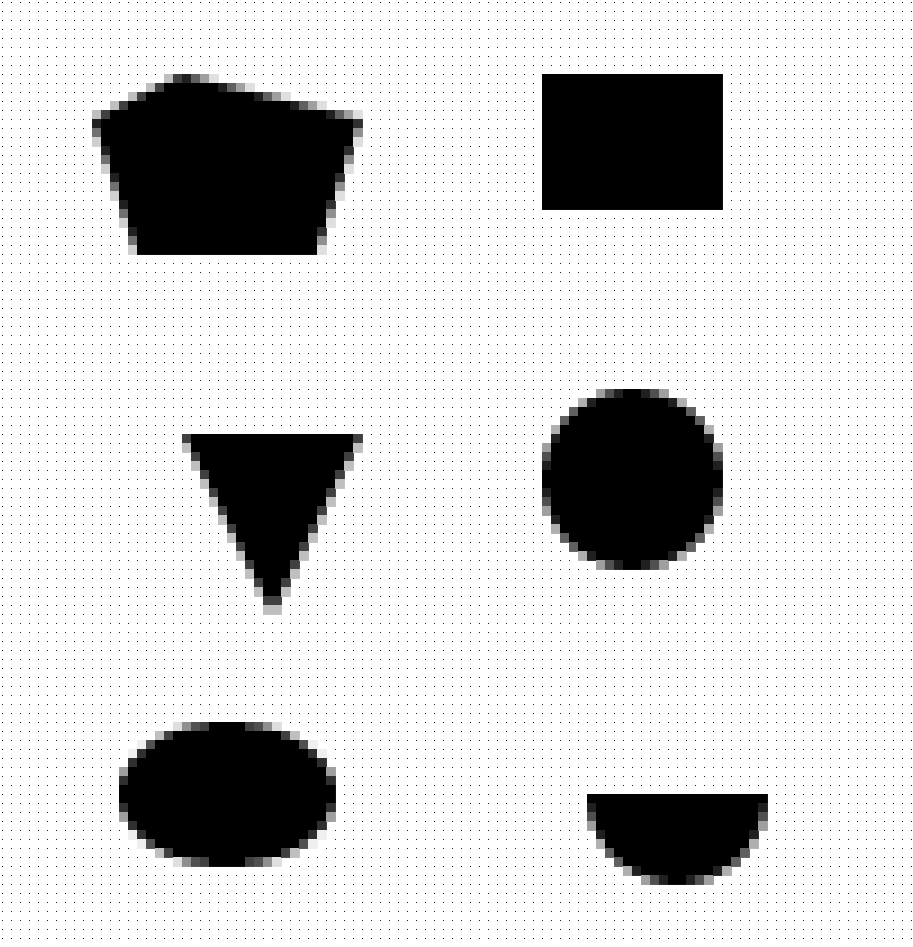

# PixelRaster 2D

A pixelated rasterizer built to experiment with the creation of primitive 2D shapes, anti-aliasing techniques, and gradient-based coloring.

## Features

- **Primitives**
  - Polygon
  - Rectangle
  - Triangle
  - Circle
  - Ellipse
  - Arc
  - Line
- **Anti-Aliasing**
  - Supersampling-based pixel coverage
- **Gradients**
  - Linear (horizontal and vertical)
  - Radial (center-based smooth blending)

## Examples

### Example 1: All Shapes without Gradient (Except line)

### Example 2: All Shapes with Gradients (Except line)
